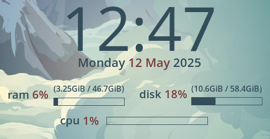

# A README for my Conky window's config and script files

This repository contains the files used to draw the Conky window on my laptop's monitor.  

 

There is a standard .conkyrc file that creates the window and the text elements within. The accompanying Lua script draws a radial gradient behind the window to help separate the text from the background wallpaper. 

== Documentation ==

The PDF describes the contents of both files and includes notes on how you can modify this Conky window to your liking.  This documentation also exists as a GitBook page. 

**Note:** This documentation follows the DITA standard. I used the open-source XML Copy Editor to create the individual topics and the DITA OT engine to generate the PDF and markdown outputs. The PDF output appears in this repository, and the markdown files exist in a separate repository that automatically links to GitBook. 
